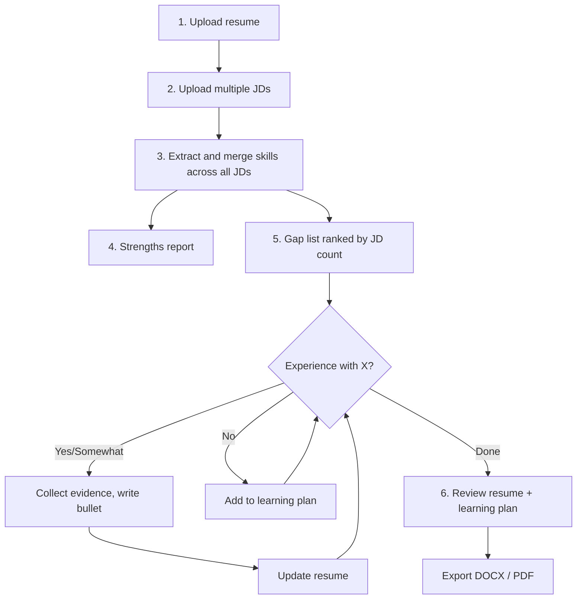
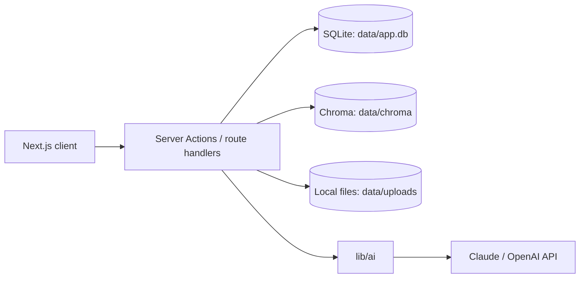

# Resume Tailor — Specification

## Overview

Resume Tailor is a local, single-user app: it runs on the user's machine with a web UI, stores everything on local disk, and only sends data out for AI model and embedding calls.

The user uploads a resume and a set of 2–20 job descriptions (a "target set"). The app:

1. Extracts skills from every JD and ranks them by demand (how many JDs ask for each).
2. Shows the resume's strengths first: in-demand skills already covered, and the strongest bullets.
3. Interviews the user about each gap, one at a time, highest demand first.
4. **Yes / Somewhat** → collects evidence, drafts a truthful bullet in the JDs' wording, updates the resume.
5. **No** → adds the skill to a learning plan with keywords, related skills, and ways to learn it.
6. Exports an ATS-safe resume (DOCX/PDF) and the learning plan.

**Non-goals (v1):** auto-applying, scraping job boards at scale, cover letters, and any claim the user hasn't confirmed.

## User flow



### Step detail

1. **Upload resume.** PDF or DOCX → parsed into roles, dates, bullets, skills, education. User confirms roles.
2. **Add JDs.** Paste, file, or URL; 2–20 per target set. Show company/title/seniority for confirmation; flag duplicates.
3. **Analyze.** Extract keywords per JD → merge into canonical skills → score demand → classify coverage against the resume.
4. **Strengths.** Covered in-demand skills with their proof bullet; top 3–5 strongest bullets; optional rewording suggestions using JD phrasing (never applied without approval).
5. **Gap interview.** For each missing/weak skill, highest demand first: "7 of your 10 target roles ask for A/B testing. Have you done this?" → Yes / Somewhat / No.
   - Yes/Somewhat: 2–4 follow-ups (role, what you did, tools, scale, result) → drafted bullet → accept / edit / regenerate → written into the resume under that role; skill added to Skills section.
   - No: create a LearningItem.
   - User can reorder, skip, dismiss, pause, and resume.
6. **Review & export.** Updated resume with changes highlighted, coverage before/after, learning plan. Optional: create a per-job variant from one JD.

## Functional requirements

| ID | Area | Requirement | Priority |
| --- | --- | --- | --- |
| F1 | Resume import | Parse PDF/DOCX into roles, dates, bullets, skills, education; user confirms roles | P0 |
| F2 | JD ingestion | Add 2–20 JDs per target set by paste or file; strip boilerplate (EEO, benefits, company blurb) | P0 |
| F3 | JD ingestion | Add JDs by URL: LinkedIn job links, plus any page with schema.org JobPosting data (Greenhouse, Lever, Ashby, many career sites); otherwise paste | P1 |
| F4 | JD ingestion | Flag duplicate / near-duplicate JDs | P1 |
| F5 | Extraction | Per JD: skills, tools, certifications, domain terms, soft skills, years of experience, seniority | P0 |
| F6 | Aggregation | Merge synonyms into canonical skills, keeping each JD's exact phrase | P0 |
| F7 | Aggregation | Demand score per skill: JD count, weighted required vs preferred | P0 |
| F8 | Coverage | Classify each skill as covered / weak / missing vs the resume | P0 |
| F9 | Strengths | Covered skills with proof bullets, strongest bullets, rewording suggestions | P0 |
| F10 | Gap interview | One gap per step, highest demand first; Yes/Somewhat/No + 2–4 follow-ups | P0 |
| F11 | Gap interview | Reorder, skip, dismiss gaps; save/pause/resume at any step | P0 |
| F12 | Resume update | Draft bullets (action–scope–result) in JD phrasing; show keywords hit | P0 |
| F13 | Resume update | Accept / edit / regenerate; accepted bullets and skills written immediately | P0 |
| F14 | Resume update | Flag claims not supported by user answers; block export until resolved | P0 |
| F15 | Learning plan | For each No: employer keywords, related skills, demand count, ways to learn | P0 |
| F16 | Learning plan | Export as checklist; mark done → mini-interview to add it to the resume | P1 |
| F17 | Scoring | Coverage score across the target set, before/after | P0 |
| F18 | Export | ATS-safe DOCX and PDF | P0 |
| F19 | Library | Save every accepted bullet and answer to a reusable experience library | P0 |
| F20 | Variants | Per-job variant from one JD (reorder bullets, adjust summary) | P1 |
| F21 | Extras | Cover letters, interview talking points | P2 |

### Handling answers

- **Yes:** gather role, action, tools, scale (team, users, budget, data volume), outcome. Write the bullet, update the resume.
- **Somewhat:** ask for adjacent experience, write it honestly ("exposure to", "supported"). Also create a LearningItem. The skill is not added to the Skills section (a skills list implies proficiency); the bullet carries it.
- **Certifications:** Yes adds the certification to the certifications section, with no follow-ups or bullet; there's no Somewhat.
- **No:** never add to the resume. Create a LearningItem with keywords, related skills, JD count.

## Architecture



Everything except the model API runs on the user's machine. Model calls, parsing, and rendering run server-side only, in the Next.js process (no job queue); the interview streams via SSE.

## Data model

SQLite via Drizzle (`db/schema.ts`). Single local user, so there are no `user_id` columns; the one user is the `profile` row `local`, which is also the `user_id` on vectors.

| Entity | Key fields |
| --- | --- |
| Profile | id (`local`), name, email, phone, location, links[], preferences (page length, tone) |
| Document | id, kind (jd/resume), title, filename, stored_path, source_url, text, content_hash, created_at — the local library of everything uploaded, pasted, or imported from a link |
| KeywordExtraction | document_id, prompt_version, model, result — cached extraction per JD |
| Resume | id, document_id, title, sections (contact, summary, skills, education, certifications, other), is_master |
| Role | id, resume_id, position, employer, title, location, start_date, end_date |
| Bullet | id, role_id, position, text, source (original/generated), status (draft/accepted), evidence_id, keywords_hit[], claims[], unverified_claims[] — original resume bullets and generated ones share this table |
| Skill | id, key, canonical_name, category, synonyms[] (user-added) |
| TargetSet | id, name, resume_id, status (draft/analyzing/ready/failed), created_at |
| Job | id, target_set_id, document_id, company, title, seniority, years_experience_min, source_url, jd_clean |
| JobKeyword | id, job_id, skill_id, jd_phrase, evidence_quote, importance (required/preferred/mentioned) — one row per mention |
| JobSkillScore | job_id, skill_id, importance, frequency, in_title, in_first_third, score — score_j, once per JD and skill |
| SkillDemand | id, target_set_id, skill_id, jd_count, required_count, demand_score, must_do, rank, coverage (covered/weak/missing), matched_term, coverage_evidence[], terms[], proof_bullet_id, user_rank, dismissed |
| RewordSuggestion | id, target_set_id, bullet_id, skill_id, original_text, suggested_text, jd_phrase, status (pending/accepted/dismissed), prompt_version |
| GapAnswer | id, skill_demand_id (one per gap), response (yes/somewhat/no), follow_ups[], role_id, draft (variants + evidence), completed_at, evidence_id |
| Evidence | id, role_id, skills (via evidence_skills), situation, action, tools[], scale, result, metric |
| LearningItem | id, skill_id (one per skill), target_set_id, keywords[], related_skills[], jd_count, meaning, resources[], prompt_version, status (to_learn/learning/done) |
| ResumeVersion | id, target_set_id, job_id (null = set-wide), summary, skills[], bullet_ids[], score_before, score_after, docx_path, pdf_path |

Deletes cascade down ownership: resume → roles → bullets, resume → target sets → jobs, keywords, demands, answers. Deleting a library JD removes it from target sets. Evidence and learning items belong to the user and survive a target set's deletion. Skills can't be deleted while referenced.

Embeddings: one per requirement line (JobKeyword) and one per Evidence record, so retrieval is JD requirement → user evidence. Vectors live in Chroma (collections `job_keywords`, `evidence`), not SQLite; each Chroma record uses the SQLite row id as its id and carries `user_id` metadata for per-user filtering. Embeddings are created with OpenAI (`text-embedding-3-small` by default) through LangChain.

## AI design

### 1. Keyword extraction (one call per JD)

Output per item (Zod schema):

```ts
{
  jd_phrase: string,        // exact wording in the JD
  canonical_skill: string,
  category: "hard_skill" | "tool" | "soft_skill" | "domain" | "certification",
  importance: "required" | "preferred" | "mentioned",
  evidence_quote: string    // must appear verbatim in the JD, else drop
}
```

### 2. Scoring (deterministic, `lib/analysis`)

Per JD:

```
score_j(s) = 3*required + 1.5*preferred + ln(1 + frequency) + 1*in_title + 0.5*in_first_third
```

Across the set:

```
demand(s) = sum over JDs of score_j(s)     // UI shows "asked by n of N JDs"
```

Weights live in config. User overrides always win.

### 3. Coverage matching

Exact + synonym match against resume text, then embedding similarity for what's still missing: a skill is "weak" when one of its JD requirement lines has cosine ≥ 0.80 with an experience bullet (not summary or skills-list lines, which read as similar to almost anything; tools skipped, since a similar tool list names different tools). Weak matches are confirmed in the interview.

### 4. Strengths detection

- Proof bullet = best match for each covered skill.
- Bullet strength = strong verb + concrete scope + measurable result + in-demand keywords. Show top 3–5.
- Rewording suggestions for bullets that prove a skill in different words; never auto-applied.

### 5. Gap interview questions

- Prompt per skill category → 2–4 follow-ups, one at a time.
- Skip questions already answered (e.g. metric already given).
- Offer matching experience-library entries first.

### 6. Bullet writing

- Inputs: evidence, target skill, JD phrase(s), 2–3 neighboring gap keywords, seniority, style rules.
- Rules: strong verb first; 1–2 lines; JD phrase used once; metric only if the user gave it; no first person; past tense for past roles.
- Output: 2 variants + `keywords_hit[]` + `claims[]`.

### 7. Claim check

Separate call compares `claims[]` with the user's answers and resume. Unsupported → `unverified_claims[]`, amber highlight, blocks export.

### 8. Learning plan (one call per No/Somewhat)

- Inputs: skill, all JD phrases for it, JD count, user's nearby skills.
- Output: keywords, 2–4 related skills, "what employers mean by this", ways to build it (course type, certification, portfolio project). No invented course names or URLs.

### 9. Prompt quality

Prompts are versioned in `lib/ai/prompts`. Golden tests on 20–30 fixture JDs check extraction recall, JSON validity, and zero unsupported claims.

## API

| Method | Endpoint | Purpose |
| --- | --- | --- |
| POST | /api/resumes | Upload resume; returns parse job id |
| GET | /api/resumes/:id | Parsed roles, bullets, skills |
| POST | /api/target-sets | Create target set for a resume |
| POST | /api/target-sets/:id/jobs | Add JDs (text, files, URLs) |
| POST | /api/target-sets/:id/analyze | Extract, merge, score, classify; returns job id |
| GET | /api/target-sets/:id/strengths | Covered skills, strongest bullets, suggestions |
| GET | /api/target-sets/:id/gaps | Ranked gaps with JD counts |
| PATCH | /api/target-sets/:id/gaps | Reorder, skip, dismiss |
| POST | /api/target-sets/:id/interview/step | Run the pending model step for a gap (next question, or drafts + claim check); progress as SSE |
| PATCH | /api/bullets/:id | Accept (writes to resume), edit, regenerate |
| GET | /api/learning-plan | Learning items, filterable |
| PATCH | /api/learning-items/:id | Update status; "done" starts mini-interview |
| GET | /api/target-sets/:id/score | Coverage before/after |
| POST | /api/versions/:id/export | Render DOCX/PDF or learning plan; signed URLs |

## Screens

| Screen | Shows | Actions |
| --- | --- | --- |
| 1. Upload resume | Drop zone → parsed roles and bullets | Upload, fix roles, continue |
| 2. Add JDs | Multi-paste, file drop, URL field; list of JDs | Add, remove, name set, analyze |
| 3. Strengths | Covered skills with proof bullets; strongest bullets; suggestions | Accept/ignore, continue |
| 4. Gap overview | Ranked gap cards ("asked by 7 of 10", required/preferred) | Reorder, dismiss, start |
| 5. Gap interview | Left: question + Yes/Somewhat/No. Right: live resume, new bullets highlighted; learning-plan counter | Answer, accept/edit/regenerate, skip, pause |
| 6. Learning plan | Skills grouped by demand, keywords, related skills, ways to learn | Mark learning/done, export |
| 7. Review & export | Resume with changes highlighted, coverage before/after | Edit, download, per-job variant |

Interaction details: progress bar ("Gap 4 of 12", must-do = asked by ≥ half the JDs); keyword tags on each new bullet; "Why this skill?" shows source JD sentences; keyboard shortcuts 1/2/3 and Enter.

## Non-functional requirements

| Area | Target |
| --- | --- |
| Privacy | No training on user data; zero-retention model settings where available |
| Data control | All data lives in `data/`; deleting a library item removes its file; deleting `data/` removes everything |
| Security | Server binds to 127.0.0.1 only (no auth); API keys only in `.env.local`; no data leaves the machine except model/embedding calls. URL import fetches only the page the user gives, when asked; links to loopback/private/link-local addresses are refused, including after redirects |
| Latency | Analysis of 10 JDs < 30 s; first interview token < 2 s; export < 15 s |
| Cost | Target < $0.50 per target set (verify against current model pricing) |
| Reliability | Interview state saved after every answer; retries with backoff |
| Accessibility | WCAG 2.1 AA; keyboard navigation; screen-reader labels |
| Observability | Log prompt version, tokens, latency, guardrail flags; no resume/JD text |

## Success metrics

- First target set to finished resume: < 25 minutes.
- Coverage score: +25 points average before → after.
- Bullet acceptance: ≥ 60% with light or no edits.
- Unsupported claims in exports: 0.

## Open questions

- ~~Personal tool or multi-user product?~~ Decided 2026-09-23: local, single-user tool.
- Browser extension to capture JDs in v2?
- Default template and page length?
- One master resume per user, or several tracks?
